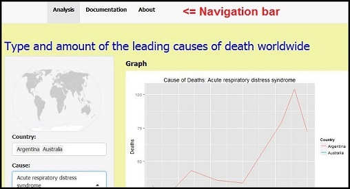
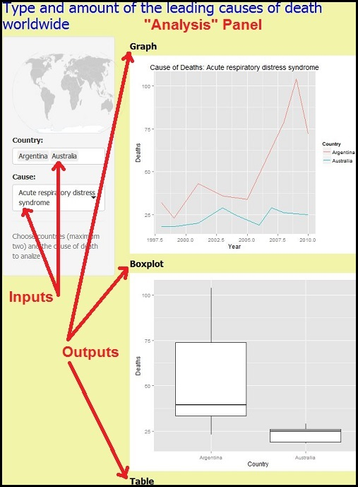

# Documentation

***

## Contents

[1. Introduction](#int)

[2. How to use](#how)

[3. About the data](#abt)

[4. Limitations](#lim)

[5. Future enhancements](#fut)

[6. References](#ref)

[7. Appendix](#apd)


## <a id="int"></a>1. Introduction


This application was built fo the **Developing Data Products** course, part of [**the Johns Hopkins Data Science Specialization** on **Coursera**] (http://www.coursera.org/specialization/jhudatascience/1). 

It has the purpose to provide an easy tool to that data on deaths and their causes in the world could be analyzed and compared across countries. It was planned the application would allow to predict the amount of deaths for years to come with a specific cause, but unfortunately it was not possible to implement this feature in the current version.

The application was built with R language [[3]](http://www.r-project.org/) using Shiny, an R package that makes it easy to build interactive web applications. Shiny is an RStudio project


## <a id="how"></a>2. How to use

The application is very simple. 

It has a navigation bar with three panels. The first one, **Analysis**, is the main panel, and it has the input tools and the output. The second one, **Documentation**, has a document with the following topics: Introduction, How to use, About the data, Limitations, Future enhancements and References. The least panel, **About**, has information about the current version. 

The inputs and outputs are in the main panel (**Analysis**). The following images shows the  navigation bar and part of the main panel.




### Inputs Tools

There are two input tools:

- **County** - It is a select box with the list of the countries. The user can choose one or more countries to compare data. It recommends choosing only two countries, at most so that the graphics do not contain much information. After selection, the user should click outside.

- **Cause** of the deaths - It is also a select box with the list of causes from [[2]](http://www.cdc.gov/nchs/icd/icd10cm.htm). The user can choose only one cause. After selection, the user should click outside.

The user should note that for some causes can be no or few deaths, depending on the chosen country. 

### Output

There are three outputs:

- **Graph** - After the user to select the countries and cause, the application plots the line graph with the data from from selected countries. Each country has a specific color line. 

- **Boxplot** - the application shows the box plot from each country. This way, the user can analyze, for example, means, quartiles and outliers.

- **Table** - the application also shows the respective table data below the graph.

The following image shows the  main panel.




## <a id="abt"></a>3. About the data

The source data, [[1]](http://www.who.int/healthinfo/statistics/mortality_rawdata/en/) and [[2]](http://www.cdc.gov/nchs/icd/icd10cm.htm), is on the public repository about health data.

It was necessary to perform some steps to clean and transform the data before use them. The steps are in the [Appendix](#apd).


## <a id="lim"></a>4. Limitations

Some limitations in the deployment of this application are:

- The source data do not have information for all causes and  years for some countries. Then, it was necessary to apply some filters to get the maximum of complete information. The application has only available the amount of deaths greater than 500. For this reason, there is not the complete list of causes and countries for input.

- The time limits defined to deploy the application.


## <a id="fut"></a>5. Future enhancements

The feature provides the following future enhancements:

- Add an input to provide prediction functionalities. 

- Improve steps for the data transformation and cleaning to get more causes and countries.

- Improve the layout of the panels.

## <a id="ref"></a>6. References

[[1]](http://www.who.int/healthinfo/statistics/mortality_rawdata/en/) **World Health Organization, mortality database**. World Health Organization . Available at http://www.who.int/healthinfo/statistics/mortality_rawdata/en/index.html (Accessed on 03/17/2015).

[[2]](http://www.cdc.gov/nchs/icd/icd10cm.htm) **International Statistical Classification of Diseases and Related Health Problems, 10th Revision (ICD-10)**. CDC Centers for Disease Control and Prevention. Available at http://www.cdc.gov/nchs/icd/icd10cm.htm (Accessed on 03/17/2015).


[[3]](http://www.r-project.org/) **R language**. The R Project for Statistical Computing. Available at http://www.r-project.org/ (Acessed on 01/15/2015).


## <a id="apd"></a>7. Appendix

This is the R-script used for the data transformation and cleaning:

```{r aa, collapse=TRUE, eval=FALSE, echo=FALSE}
# This script has the steps to prepare data from 
# http://www.who.int/healthinfo/statistics/mortality_rawdata/en/index.html
# and
# http://www.cdc.gov/nchs/icd/icd10cm.htm.
# The data are used for the application https://dsasas.shinyapps.io/DDPapp/

# Set the working directory
setwd("C:/Courseradata/DDP")

# Reading the Morticd10.csv file to morticd10  data.frame
morticd10 <- read.csv("Morticd10.csv", na.strings=c("NA","","NULL","#DIV/0!"), strip.white=TRUE)

# Reading the country_codes.csv file to country  data.frame
country <- read.csv("country_codes.csv")

# Reading the pop.csv file to pop  data.frame
pop <- read.csv("pop.csv", na.strings=c("NA","","NULL","#DIV/0!"), strip.white=TRUE)

# Reading the icd10cm_order_2015.txt file to icd10  data.frame
icd10 <- read.fwf("icd10cm_order_2015.txt", widths=c(-6, 8, 1,-1,60))


# Loading data.table library
library(data.table)

# Creating a new data.frame from morticd10 with aggregate information by Country, Year and Cause
newMorticd10 <- aggregate(morticd10["Deaths1"], by=morticd10[c("Country","Year","Cause")], FUN=sum)

# Changing names to be able to merge operation
setnames(country, old='country', new = 'Country')
setnames(country, old='name', new = 'Name')

# Merging country and newMorticd10 to insert country names
newMorticd10_a <- merge(country,newMorticd10,by="Country") 

# Removing all whitespace from "Cause" column
trim <- function (x) gsub("^\\s+|\\s+$", "", x) 
newMorticd10_a$Cause <- trim(newMorticd10_a$Cause)

# Creting a new column (Char) with "Cause" column length 
newMorticd10_a$Char <- nchar(newMorticd10_a$Cause)

# Subseting newMorticd10_a: removing columns with Char < 4
newMorticd10_b <- subset(newMorticd10_a, Char < 4 )

# Removing all whitespace from "Cause" column (icd10)
icd10$V1 <- trim(icd10$V1)

# Creting a new column (Char) with "Cause" column length (icd10)
icd10$V4 <- nchar(icd10$V1)

# Subseting icd10: removing columns with Char < 4
newIcd10 <- subset(icd10, V4 < 4)

# Changing names to be able to merge operation
setnames(newIcd10, old='V1', new = 'Cause')
setnames(newIcd10, old='V3', new = 'Cause_name')

# Merging newIcd10 and newMorticd10_b to insert cause names
newMorticd10_c <- merge(newIcd10,newMorticd10_b,by="Cause")


# Creating a new data.frame from pop with aggregate information by Country and Year
newPop <- aggregate(pop["Pop1"], by=pop[c("Country","Year")], FUN=sum)

# Subseting pop: removing not used columns
var <- c('Country','Year', 'Pop1')
newPop <- newPop[var]

# Merging newPop and newMorticd10_b to insert population amount
newMorticd10_d <- merge(newPop,newMorticd10_c,by=c("Country", "Year"))

# Changing "Name" to "Country_name" 
setnames(newMorticd10_d, old='Name', new = 'Country_name')

# Erasing data not used
morticd10 <- 0
newMorticd10 <- 0

# Loading ggplot2 library
library(ggplot2)

# 
trim.trailing <- function (x) sub("\\s+$", "", x)
newMorticd10_c$Cause_name <- trim.trailing(newMorticd10_c$Cause_name)

setnames(newMorticd10_c, old='Deaths1', new = 'Deaths')
setnames(newMorticd10_c, old='Country', new = 'Country_code')
setnames(newMorticd10_c, old='Name', new = 'Country')
setnames(newMorticd10_c, old='Cause', new = 'Cause_code')
setnames(newMorticd10_c, old='Cause_name', new = 'Cause')
teste =  subset(newMorticd10_c, Country_code == "2070"  & Cause_code == "I81")
ggplot(teste,aes( Year, Deaths)) + geom_line()

qplot(Year, Deaths, data = teste, color=Country,  geom = "line", main = paste0("Cause of Deaths: ", teste$Cause[1])[1])


# Saving newMorticd10_d.csv
write.csv(newMorticd10_d, file = "newMorticd10_d.csv"
write.csv(newMorticd10_c, file = "newMorticd10_c.csv")

a <- subset(Morticd10, Cause=="I50" )

morticd10 <- read.csv("newMorticd10_c.csv")
temp <<- data.frame(unique(morticd10$Country))
names(temp) <- "Country"
temp1 <- order(temp$Country)
c <- data.frame(temp$Country[temp1])
names(c) <- "Country"
write.csv(c, file = "country.csv")

temp <<- data.frame(unique(newMorticd10_c$Cause))
names(temp) <- "Cause"
temp1 <- order(temp$Cause)
c <- data.frame(temp$Cause[temp1])
names(c) <- "Cause"
write.csv(c, file = "cause.csv")

```
